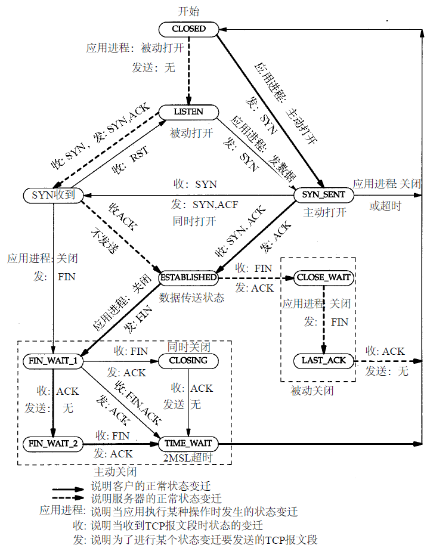

# 概述
## 封装
[数据进入协议栈时的封装过程](../picture/10.png)
## 客户端-服务器模型
服务分为两种类型：重复型或并发型。
一般来说， T C P服务器是并发的，而U D P服务器是重复的，但也存在一些例外
## 端口号
大多数Unix系统的文件/etc/services都包含了人们熟知的端口号
## 应用编程接口
TCP/IP协议的应用程序通常采用两种应用编程接口（API）：socket和TLI

# 链路层
## 链路层目的
```
（1）为IP模块发送和接收IP数据报；
（2）为ARP模块发送ARP请求和接收ARP应答；
（3）为RARP发送RARP请求和接收RARP应答。
TCP/IP支持多种不同的链路层协议取决于网络所使用的硬件，如以太网、令牌环网、FDDI（光纤分布式数据接口）及RS-232串行线路
```

## 以太网链路层协议（多个连接在一起）
```
以太网和IEEE 802封装
1、以太网
是当今TCP/IP采用的主要的局域网技术，速率为10Mb/s，地址为48bit，
2、IEEE 802
802.3针对整个CSMA/CD网络，802.4针对令牌总线网络， 802.5针对令牌环网络
[IEEE 802.2/802.3（RFC 1042）和以太网的封装格式（RFC 894）](../picture/11.png)
```

## 两个串行接口链路层协议（点对点连接，所以没有以太网的头部）
```
（1）SLIP和CSLIP
（2）PPP
点对点链路链接不用ARP协议
```

## 环回接口
```
允许运行在同一台主机上的客户程序和服务器程序通过TCP/IP进行通信，P地址127.0.0.1分配给这个接口，并命名为localhost。一个传给环回接口的IP数据报不能在任何网络上出现。
[环回接口处理IP数据报的过程](../picture/12.png)
```

## 以太网帧
```
| Mac首部 | IP首部 | TCP首部 | HTTP首部 | HTML数据 |
<------------------以太网帧----------------------->
          <--------------以太网帧的净荷------------>
                  <---------ip净荷---------------->
                        <--------tcp净荷---------->
```

## MTU
```
最大传输单元，MTU是数据链路层的概念
数据链路不同，最大传输单元也不同，由于IP协议是数据链路的上一层，所以它必须不受数据链路的MTU大小的影响能够加以利用。当IP数据报太大时，就要采用分片技术，以保证数据帧不大于要过的网络的MTU。
```

# IP协议
## IP首部
```
+--------+-------------+-------------+-------------------------+
| 4位版本 | 4位首部长度 | 8位服务类型  |      16位总长度          |
+--------+-------------+-------------+----------+--------------+
|              16位标识符             |  3位标志 |  13位片偏移   |
+------------------------------------+----------+--------------+
|   8位生存时间(TTL) 8位协议          |     16位首部检验和        |
+------------------------------------+ ------------------------+
|                          32位源ip地址                         |
+--------------------------------------------------------------+
|                         32位目的ip地址                        |
+--------------------------------------------------------------+
|                          选项（如果有）                       |
+--------------------------------------------------------------+
|                              数据                            |
+--------------------------------------------------------------+

> 4位版本号：IPv4
> 首部长度：首部占32bit字的数目,例如5表示5*32=20byte（所以首部肯定为32的整数倍）
> 8位服务类型（TOS）:包括一个3bit的优先权子字段（现在已被忽略），4 bit的TOS子字段和1bit未用位但必须置0,4bit中只能置其中1bit。如果所有4 bit均为0，那么就意味着是一般服务。4bit分别代表最小时延、最大吞吐量、最高可靠性和最小费用
> 16位总长度，整个IP数据报的长度，以字节为单位，最长可达65535字节，但是大多数的链路层都会对它进行分片
> 16位标识，每发送一份报文它的值就会加1
> 3位标识，13位片偏移
> 8位生存时间（TTL）,一旦经过一个处理它的路由器，它的值就减去1。当该字段的值为0时，数据报就被丢弃
> 8位协议，指的是TCP、UDP、ICMP、IGMP
> 16位首部检验和，首部每个16位进行反码求和，结果存在检验和字段中。当收到ip数据报时，对首部每个16位进行反码求和（包含了检验和字段），结果应该为1（由于路由器经常只修改TTL字段（减1），因此当路由器转发一份报文时可以增加它的检验和，而不需要对IP整个首部进行重新计算）
> 32位源ip地址
> 32位目的ip地址
> 附加项字段，路径路由ip等


```

## IP路由选择
```
IP层在内存中有一个路由表，当收到一份数据报时，先检查ip是否为本机ip地址之一或广播地址，
如果是按照ip首部制指定的协议进行处理，不是就进行转发（路由选择）
路由表包含：
（1）目标IP地址：完整的主机地址或者一个网络地址
（2）下一站路由IP地址：
（3）标志：目的ip是网络还是主机地址
路由选择：
（1）能与目的IP完全匹配的表目，发送指定的下一站路由或网路接口
（2）能与目的IP网络号匹配的表目，发送指定的下一站路由或网路接口
（3）发送默认表目
```

## 静态选路
```
3种方法生成路由表：
> 系统默认的方式生成路由表项
> 通过route来增加表项
> 通过ICMP报文来更新表项
     当IP包在某一个地方转向的时候，都回给发送IP报的源主机一个ICMP重定向报文，而源主机就可以利用这个信息来更新自己的路由表，这样，随着网络通信的逐渐增多，路由表也就越来越完备，数据转发的速度也会越来越快。我们需要注意的是：重定向报文只能由路由器发出；重定向报文为主机所用，而不是为路由器所用。
```

## 动态选路
```
当上面3种方式不能用时，就使用动态选路协议。注意：动态选路不会改变IP层的选路方式。仅仅改变路由表的信息（随时间的变化，路由守护程序会动态的更新路由表信息）
```

## 子网寻址（子网掩码）
```
//结构
     网络号    子网号    主机号

//子网掩码
     作用是多少比特用于子网号及多少比特用于主机号

//在主机上设置子网掩码的作用只有一个，就是判断将要连接的ip地址和主机是否处于一个子网，如果是，则只经过数据链路层，直接发送到ip地址，而不经过路由，否则将数据包发送到路由。

//掩码是一个32bit的值，其中值为1的比特留给网络号和子网号，为0的比特留给主机号。
两种不同类型
B类:11111111 11111111 11111111    00000000
         网络号16位     子网号      主机号
    11111111 11111111 11111111 11 000000
         网络号16位     子网号      主机号
```

## 相关命令
```
//ipconfig

//netstat
     提供系统上的接口信息
```


## ARP和RARP协议
1、ARP
```
//概念
     ARP协议是地址解析协议（Address Resolution Protocol）是通过解析IP地址得到MAC地址的，是一个在网络协议包中极其重要的网络传输协议，它与网卡有着极其密切的关系

     通常网卡仅接收目的地址为网卡物理地址或广播地址的帧

     ARP发送一份称作ARP请求的以太网数据帧给以太网上的每个主机。这个过程称作广播。目的主机的ARP层收到这份广播报文后，识别出这是发送端在寻问它的IP地址，于是发送一个ARP应答。这个ARP应答包含IP地址及对应的硬件地址。收到ARP应答后，使ARP进行请求—应答交换的IP数据报现在就可以传送了

//命令
     检查arp高速缓存中Ip地址到硬件地址之间的映射记录：arp -a

//交换机与路由器
     交换机主要工作在数据链路层（第二层），交换机转发所依据的对象时：MAC地址。（物理地址）
     路由器工作在网络层（第三层）。路由转发所依据的对象是：IP地址。（网络地址）
     所以需要ARP协议，需要目的IP地址的MAC地址

//发送过程
     我的电脑 ------------> 网关 -------------> 服务器
               网关的MAC          服务器的MAC
     注意：点对点链路不涉及ARP协议

//免费ARP
     一种ARP特性，它是指主机发送ARP查找自己的IP地址。通常，它发生在系统引导期间进行接口配置的时候     
     主要用于检测网络中IP地址是否冲突，它是一种功能而非协议。向自己所在网络请求自己的MAC地址，当网络中如果有其他主机使用了与自己相同的IP地址，他就会给主机一个ARP回复，此时如果发免费ARP的主机收到了回复就证明自己所用的IP地址有冲突，如果没有收到回复则说明没有IP地址冲突。

```

2、RARP
```
//概念
     ARP是实现IP到MAC地址的映射，而RARP是实现MAC到IP地址的映射。

```

## UDP
```
1、首部
     +------------------------------------------------------------+----------
     |                         32位源IP地址                        |
     +------------------------------------------------------------+ 
     |                         32位目标IP地址                      | UDP伪首部 
     +---+-------------------------+------------------------------+
     | 0 |        8位协议(17)       |          16位UDP长度         |
     +---+-------------------------+------------------------------+----------
     |        16位源端口号          |         16位目标端口号        |
     +-----------------------------+------------------------------+ UDP首部
     |         16位UDP长度          |         16位UDP检验和        |
     +-----------------------------+------------------------------+----------
     |                            数据                            |
     +                  +-----------------------------------------+
     |                  |              填充字节                    |  
     +------------------+-----------------------------------------+
     
     UDP伪首部：和TCP段都包含一个12字节长的伪首部，为了为了计算检验和而设置的。其目的是让UDP两次检查数据是否已经正确到达目的地（例如， IP没有接受地址不是本主机的数据报，以及IP没有把应传给另一高层的数据报传给UDP）
     UDP首部

2、UDP检验
     UDP检验和覆盖UDP首部和UDP数据
     检验方法与ip类似（16 bit字的二进制反码和）。因为UDP数据报的长度可以为奇数字节，在最后增加填充字节0
     发送方先对UDP检验和的16位全至为0，然后对其进行反码求和，结果写道UDP检验和处。接收方以16位为单位对所有进行加和，结果应为0XFFFF，如果有错就直接丢弃，不报错

3、分片
     任何时候IP层接收到一份要发送的IP数据报时，它要判断向本地哪个接口发送数据（选路），并查询该接口获得其MTU。IP把MTU与数据报长度进行比较，如果需要则进行分片
     IP层本身没有超时重传的机制，丢失一片数据也要重传整个数据报
     UDP层没有分片机制
```

### TCP
```
1、TCP首部
     https://coolshell.cn/articles/11564.html

     +----------------------------------------------------------+--------------------------------------------------+
     |                          16位源端口号                     |                  16位目的端口号                   |
     +----------------------------------------------------------+--------------------------------------------------+
     |                                                      32位序列号                                              |
     +-------------------------------------------------------------------------------------------------------------+
     |                                                     32位确认序号                                             |
     +------------+---------+-----+-----+------+-----+-----+------+------------------------------------------------+
     | 4位首部长度 | 保留6位 | URG | ACK | PSH  | RST | SYN |  FIN  |          16位窗口大小 WIN（最大65535字节）       |
     +------------+---------+-----+-----+------+-----+-----+------+------------------------------------------------+
     |                           16位检验和                        |                  16位紧急指针                   |
     +------------------------------------------------------------+------------------------------------------------+
     |                                                        选项                                                 |
     +-------------------------------------------------------------------------------------------------------------+
     |                                                        数据                                                 |
     +-------------------------------------------------------------------------------------------------------------+
     TCP首部不计任选字段，它通常是20个字节。

     URG 表示紧急指针有效。
     ACK 确认序号有效。
     PSH 接收方应该尽快将这个报文段交给应用层。
     RST 重建连接。
     SYN 同步序号用来发起一个连接。
     FIN 发端完成发送任务。     
     紧急指针 是一个正的偏移量，和序号字段中的值相加表示紧急数据最后一个字节的序号
     最常见的可选字段是最长报文大小，又称为MSS (Maximum Segment Size)。

2、TCP如何来保持可靠性
     (1) 应用数据被分割成合适的块（报文段）
     (2) 当TCP发出一个报文段后，会启动一个定时器。如果不能及时收到确认，就会重新发送这个报文段
     (3) 收到数据后需要进行确认，但不是立即发送(时延的确认)
     (4) 保持首部和数据的检验和，检验错误会重发
     (5) TCP收到的数据会进行排序
     (6) TCP接收端会丢掉重复发送的数据
     (7) TCP提供流量控制(滑动窗口协议)

```

### TCP的连接与终止
```
1、tcpdump抓包工具
     //返回结果
     16:08:33.130225 IP localhost.ssh > localhost.51708: Flags [P.], seq 240368:240912, ack 3361, win 1578, length 544, mss 1024
     时间               源地址           目的地址          标志                           
     1) flag
          标识 3字符缩写 描述
          S    SYN      同步序号
          F    FIN      发送方完成数据发送
          R    RST      复位连接
          P    PSH      尽可能快地将数据送往接收进程
          .             以上四个标志比特均置0
     2) seq 240368:240912
          表示分组序号是240368，报文段的字节数240912-240368=544
          Wireshark抓包程序会发现SeqNum总是为0，Wireshark为了显示更友好，使用了相对序号
     3) ack 3361
          确认序号，只有首部ACK表示被设置成1才显示
     4) win 1578
          表示发端通告窗口大小
     5) 数据字节数
          544，就是上面序列号相减
     6) mss 1024
          发端最大报文长度，表示发端不接受超过这个长度的报文段
          TCP在建立连接的时候，会协商双方的MSS值，通常这个MSS会控制在MTU以内：最大IP包大小减去IP和TCP协议头的大小（其最终目的：就是尽量避免IP分片）

2、连接与终止协议
     (1) 连接协议(3次握手)
          1) 客户端发送一个SYN打算连接的服务器的端口，以及初始序号(1415531521)
          2) 服务器发回包含服务器的初始序号的SYN报文段作为应答。同时，将客户端的序号+1以对客户的SYN报文段进行确认
          3) 客户端将服务端的序号+1以对服务端的SYN报文段进行确认
          注意：初始序号ISN随时间而变化，因此每个连接都将具有不同的ISN
          client                                       server
                         SYN seq=x
          connect ------------------------------------>  
                    SYN seq=y, ACK=x+1
               <------------------------------------ listen
                         ACK=y+1
               ------------------------------------>

     (2) 传输过程
          client                                       server
                         SYN seq=x+1, ACK=y+1
          write  ------------------------------------>  
                              ACK=x+2
               <------------------------------------ read

     (3) 终止连接(4次握手)
          client                                       server
                         FIN seq=x+2, ACK=y+1
          close  ------------------------------------>  
                         ACK=x+3
               <------------------------------------ 
                         FIN seq=y+1, ACK=x+3
               <------------------------------------ close
                         ACK=y+2
               ------------------------------------>
3、TCP状态迁移
     client状态                                           server状态
                                                          socket、bind、listen
                                                          LISTEN(被动打开) 
                                                          accept(阻塞)
     connect(阻塞)       ---------SYN j--------->        
     SYN_SEND                                             SYN_RCVD
                        <---SYN k, ACK j+1----- 
     ESTABLISHED
     connect(返回)       -------ACK k+1--------->             
                                                          ESTABLISHED                             
                                                          accept(返回)   
                                                          

     close()             --------FIN m--------->              
     FIN_WAIT_1                                           CLOSE_WAIT
                         <--------ACK m+1-------          read返回0
     FIN_WAIT_2
                         <--------FIN n---------          close
                                                          LAST_ACK                    
                         --------ACK n+1------->          CLOSED       
     TIME_WAIT
         | 等待2MSL           
     CLOSED

4、SYN超时
     (1) 发生时机
          发生在TCP三次握手中
          如果server端接到了client发的SYN后回了SYN-ACK后client掉线了，server端没有收到client回来的ACK，那么，这个连接处于一个中间状态，即没成功，也没失败，处于'半连接'状态

     (2) 处理方式
          server端如果在一定时间内没有收到的TCP会重发SYN-ACK。在Linux下，默认重试次数为5次，重试的间隔时间从1s开始每次都翻售，5次的重试时间间隔为1s, 2s, 4s, 8s, 16s，总共31s，第5次发出后还要等32s都知道第5次也超时了，所以，总共需要 1s + 2s + 4s+ 8s+ 16s + 32s = 2^6 -1 = 63s，TCP才会把断开这个连接

     (3) SYN Flood攻击
          发生在TCP三次握手中
          如果A向B发起链接，B也按照正常情况响应了，但是A不进行三次握手，会造成B分配的内存资源就一直这么耗着，直到资源耗尽
          恶意客户端发送大量的SYN后就断线了，于是服务器的syn连接的队列耗尽，让正常的连接请求不能处理

     (4) 应对方式
          1) 普通方法
               1> 提高TCP半开连接队列大小的上限
                    /proc/sys/net/ipv4/tcp_max_syn_backlog
               2> 减少半开状态下等待ACK消息的时间或者重试发送SYN-ACK消息的次数
                    /proc/sys/net/ipv4/tcp_synack_retries
               3> 在检测到监听backlog 队列已满时，直接发 RST 包给客户端终止此连接
                    /proc/sys/net/ipv4/tcp_abort_on_overflow
               上述办法会降低正常用户连接的成功率     
          2) 先进方法
               1> SYN Cache
                    1> 原理
                         构造一个全局的Hash Table，用来缓存系统当前所有的半开连接信息，连接成功则从Cache中清除相关信息
               2> SYN Cookies
                    1> 原理
                         与HTTP Cookies技术类似，server端不存储任何连接信息，而是把连接信息编码成cookies，随同SYN-ACK发给客户端
                         如果A是正常用户，则会向B发送最后一次握手消息（ACK），B收到后验证“Cookie”的内容并建立连接
                         如果A是攻击者，则不会向B反馈ACK消息，B也没任何损失，也就说是单纯的SYN攻击不会造成B的连接资源消耗
                    2> 缺点
                         server端不保存连接的半开状态，就丧失了重发SYN-ACK消息的能力

          所有这些方案都不完美各有利弊，最终的策略可能是几种方案的结合使用，形成防御体系，将攻击提前化解在局部，不至于影响整个系统

5、半关闭状态
     (1) 概念
          TCP提供连接的一端在结束它的发送后还能接受来自另一端的数据
          当TCP链接中A向B发送 FIN 请求关闭，另一端B回应ACK之后，并没有立即发送 FIN 给A,A方处于半连接状态（半开关），此时A可以接收B发送的数据，但是A已经不能再向B发送数据

     (2) 过程
          client                                        server
                              FIN
          shutdown         --------------------------> 向应用进程交付EOF       
                         <-------------------------
                              FIN的ACK

                              data
          应用进程read      <------------------------- 应用进程write
                         ------------------------->   
                              data的ACK

                              FIN
          向应用进程交付EOF <------------------------- 应用进程close
                         ------------------------->           
                              FIN的ACK

     (3) 为什么需要半关闭
          如果没有半关闭，需要其他的一些技术让客户通知服务器, 客户端已经完成了它的数据传送，但仍要接收来自服务器的数据。使用两个 T C P连接也可作为一个选择，但使用半关闭的单连接更好

     (4) close与shutdown
          1) close
               关闭本进程的sockfd
               如果多个进程共享这个套接字，一个进程关闭会导致描述符引用计数减一，直到引用计数等于零时，才会引发TCP的四路握手断连过程
          2) shutdown
               会切断进程共享的套接字的所有连接，不管这个套接字的引用计数是否为零，那些试图读得进程将会接收到EOF标识，那些试图写的进程将会检测到SIGPIPE信号
               用途：多进程，你想防止其他线程或进程访问到该资源，又或者你想立刻关闭这个socket，那么可以用shutdown()来实现，但是最后还是要调用close

          3) shutdown API
               #include <sys/socket.h>
               int shutdown(int sockfd, int how);
               //sockfd: 需要关闭的socket的描述符
               //how:    允许为shutdown操作选择以下几种方式:
               //SHUT_RD(0)： 关闭sockfd上的读功能，此选项将不允许sockfd进行读操作。该套接字不再接受数据，任何当前在套接字接受缓冲区的数据将被无声的丢弃掉。
               //SHUT_WR(1):  关闭sockfd的写功能，此选项将不允许sockfd进行写操作。进程不能在对此套接字发出写操作。
               //SHUT_RDWR(2):关闭sockfd的读写功能。相当于调用shutdown两次：首先是以SHUT_RD,然后以SHUT_WR。

          4) close和shutdown的注意内容
               1) 只要TCP栈的读缓冲里还有未读取（read）数据，则调用close时会直接向对端发送RST
               2) 即使调用shutdown(fd, SHUT_RDWR)也不会关闭fd，最终还需close(fd)。
               3) 当有多个socket描述符指向同一socket对象时，调用close时首先会递减该对象的引用计数，计数为0时才会发送FIN包结束TCP连接。shutdown不同，只要以SHUT_WR/SHUT_RDWR方式调用即发送FIN包。

6、MSL和TIME_WAIT
     (1) MSL
          报文最大寿命时间，可为30s，1min或2min。注意区分ip的TTL。
     (2) TIME_WAIT
          也称2MSL等待状态，tcp四次挥手中主动关闭连接方(client)发送完最后一次挥手，从TIME_WAIT状态到CLOSED状态有一个超时设置，这个超时设置是2MSL
          TIME_WAIT过程中client(主动关闭方)不能再被使用此端口号，只有等到2MSL结束后才能被系统使用
          1) 为什么需要time_wait
               1> 客户端发往服务端的最后一个ack确认包可能会丢失
                    //正常情况
                    client            server
                         FIN m
                         ----------->
                         ACK m+1
                         <-----------
                         FIN n
                         <-----------
                         ACK n+1
                         ----------->   
                    当client发送完最后一次的ACK(n+1)报文段后立即关闭端口，由于网络原因ACK(n+1)报文段丢失，server会重传FIN(n)报文段，但是已经关闭连接的client认为这是一个非法报文段，返回给服务端RST数据包，导致server不能进入正常的CLOSED状态，耗费资源。当网络中存在大量的timewait状态，那么服务器的压力可想而知。
               2> 有足够的时间让这个连接不会跟后面的连接混在一起
                    有些自做主张的路由器会缓存IP数据包，当系统复用已经关闭的端口，可能会导致旧应用延迟收到的包与新的应用混在一起

7、RET复位报文段
     (1) 概念
          在TCP协议中RST比特表示复位，用来关闭异常的连接，在TCP的设计中它是不可或缺的。
          对于RST报文段，另一端不需要发送任何响应，因为发送完RST报文后，这条tcp连接就关闭了，也就没有必要确认了，收到RST的一方将终止该连接，并通知应用层复位连接

     (2) 产生RST的原因
          (1) 端口不存在
          (2) 异常终止(主动)一个链接
               终止一个连接的正常方式是一方发送FIN
               但也有可能主动发送一个复位报文段而不是FIN来中途释放一个连接(需要注意的是RST报文段不会导致另一端产生任何响应，另一端根本不进行确认。收到RST的一方将终止该连接，并通知应用层连接复位)
          (3) 检测半打开连接
               如果一方已经关闭或异常终止连接而另一方却还不知道，我们将这样的TCP连接状态称为半打开连接 (TCP的keepalive选项能使TCP的一端发现另一端已经消失)

8、同时打开、同时关闭
     迁移状态与普通的不一样

```


### TCP交互数据流
```
1、交互式输入
     client                        server
     按键   ----数据字节------>     接收字节，然后进行时延的确认推迟发送ACK
            <---数据字节确认---    
            <---回显数据字节---     回显     
     显示   ------回显确认---->         
     一般可以将报文段2和3进行合并

2、交互方法
     为了提高这类数据的发送效率和降低网络负担，TCP采用了两种策略：捎带ACK(时延的确认)和Nagle算法。
     (1) 时延的确认
          通常TCP在接收到数据时并不立即发送ACK；它会推迟发送（时延为200ms），以便将ACK与需要沿该方向发送的数据一起发送。
     (2) Nagle算法
          为了减少广域网的小分组数目，从而减小网络拥塞的出现。其中小分组的定义是小于MSS的任何分组。
          该算法要求一个tcp连接上最多只能有一个未被确认的未完成的小分组，在该分组ack到达之前不能发送其他的小分组。
          使用TCP套接字选项TCP_NODELAY可以关闭套接字选项
```

### TCP的成块数据流
```
[TCP缓存区与窗口的关系]https://blog.csdn.net/yxccc_914/article/details/52515558
[TCP的那些事]https://coolshell.cn/articles/11564.html
[TCP滑动窗口协议]https://www.jianshu.com/p/07bd39becbfd

滑动窗口协议，是TCP使用的一种流量控制方法。该协议允许发送方在停止并等待确认前可以连续发送多个分组。由于发送方不必每发一个分组就停下来等待确认，因此该协议可以加速数据的传输。

1、数据传输中的标识
     例如：
                              Seq 1:1025(1024), win 4096
                              --------------------------->
                              Seq 1025:2049(1024), win 4096
                              --------------------------->
                              Seq 2049:3073(1024), win 4096
                              --------------------------->
                              ack 2049, win 4096            已收到2049个字节，当前窗口是4096
          4096-(3073-2049)    <---------------------------
                              ack 3073, win 3072            已收到3073个字节，当前窗口是3072(tcp缓存中上层应用还没读完)
          3072-(3073-3073)    <---------------------------
     
     Seq：发送包的序列号和数据大小，可以解决乱序问题 
     Ack：确认收到的序列号n，代表接收方已经接收到了前n-1字节数据。接收方不必确认每一个收到的分组，在TCP中，ACK确认是累积的，可以在接收到几个序号连续的报文段后只发送一个ACK确认报文，但累积等待的时间最长不能超过0.5秒，以防止发送端超时重传
     Win：TCP三次握手的前两次握手时协商好了发送窗口和接受窗口的大小，确定最大发送数据量
          数据传输过程中，发送方收到了接收方的win大小，来计算接下来可发送多少数据(假定当前发送方已发送到第x字节，则可以发送的字节数就是y=m-(x-n))，从而控制发送方的发送速度达到防止发送方发送速度过快而导致自己被淹没的目的。如果可发数据大小为0，则等待


2、滑动窗口
     (1) 窗口结构
                    提供的窗口（由接收方通告）
               +--------------+-------------+
          [1]  |     [2]      |    [3]      | [4] ->
               +--------------+-------------+
               |-> 合拢               收缩 <-|-> 张开
          [1] 发送并被确认
          [2] 发送但未确认
          [3] 可用的窗口(数据还未发送)
          [4] 不能发送直至窗口移动

          合拢：窗口左边沿向右边沿靠近，这种情况发生在数据被发送和确认时
          张开：窗口右边沿向右移动，这种情况发生在接收端进程从TCP接收缓存中读取了已经确认的数据并'释放'TCP接受缓存时
          收缩：窗口右边沿向左移动，一般很少发生，RFC也强烈不建议这么做，因为很可能会产生一些错误，比如一些数据已经发送出去了，又要收缩窗口，不让发送这些数据。另外，窗口的左边沿是肯定不可能左移的，如果接收到一个指示窗口左边沿向左移动的ACK，则它被认为是一个重复ACK，并被丢弃

     (2) 缓存
          TCP缓冲区，也称套接字缓冲区。是应用进程读取和写入内核的区域
          发送缓存>发送窗口
          接收缓存>接收窗口

     (3) 缓存区与窗口的关系
          TCP协议的两端分别为发送者A和接收者B，由于是全双工协议，因此A和B应该分别维护着一个独立的发送缓冲区和接收缓冲区
          1) 发送窗口
               |<------------------缓存------------------->| 
               |     |<---------窗口------->|              | 
               |-----↓---------------↓------|------↓-------|
              [0]   [1]             [2]    [3]    [4]     [5]

               [0]    缓存起始
               [0-1]  已经发送完的数据，可以丢弃     
               [1]    收到接收端ACK的位置(最后被确认的字节)，也是窗口的起始位置，向右滑动
               [1-2]  已发送的数据，但还没得到确认
               [2]    最后发送的字节
               [2-3]  可以被发送的数据(还没发送)
               [3]    窗口的终止位置，可以向右移动或不变
               [3-4]  缓存中的数据
               [4]    应用程序正在写的位置
               [5]    缓存终止   
               [1-3]  发送端窗口的大小根据接收端返回窗口大小而定(可发送数据=win-(seq-n))
               
          2) 接收窗口
               |<------------------缓存------------------->| 
               |             |-----------窗口-------|      | 
               |-----↓-------↓---□--□--↓------------|------|
              [0]   [1]     [2]       [3]          [4]    [5]

               [0]    缓存起始
               [0-1]  应用程序已经读取的数据
               [1]    应用程序正在读取的位置
               [1-2]  已确认接收的数据，但还没被应用程序读取
               [2]    最后确认接收数据的位置已发送ACK，向右移动
               [2-3]  接收发来的数据，但还没被确认，中间可能有没有收到的数据包
               [3]    当前接收数据最后的位置，没确认
               [3-4]  窗口内待接受数据内存
               [4]    窗口终止
               [5]    缓存终止
               [4-5]  当接收端源源不断收到发送端的数据，窗口[2-4]向右移动，当到缓存终点时，会导致[2-4]窗口越来越小。总之是由于应用程序不及时处理缓存中的数据
     
     (4) 特点
          > 发送方不必发送一个全窗口大小的数据
          > 发送方窗口大小可以变化，最右边不能向左移动
          > 接收方确认一个报文数据并把窗口向右边滑动
          > 接收方在发送一个ACK前不必等待窗口被填满

     (5) Zero Window
          1) 问题
               一个处理缓慢的接收端会把把发送端Sliding Window给降成0的，此时发送端会停止发送数据，但是接收端win可用时，怎么通知发送端呢？
          2) ZWP
               发送端会发ZWP的包给接收方，让接收方来ack他的Window尺寸，一般这个值会设置成3次，如果3次过后还是0的话，有的TCP实现就会发RST把链接断了

2、慢启动
     (1) 发送方一次发送多少个报文段？
          发送方'并不会'一次发送多个直到达到接收方通告的窗口大小为止报文段
          因为在多个路由器和速率较慢的链路时，一些中间路由器必须缓存分组，并有可能耗尽存储器的空间
          所以发送方必须控制一次发送报文段数量

     (2) 拥塞窗口(cwnd)
          建立TCP连接时，拥塞窗口被初始化为1个报文段(计数的方式)，然后发送一个报文段。当收到该ACK时，拥塞窗口从1增加为2，即可以发送两个报文段，当收到这两个报文段的ACK时，拥塞窗口增加到4(收到几个报文段增加几个)，然后发送4个报文段。一种指数增加关系
          例如
                         1:513(512), ack 1, win 4096
               cwnd=1    ------------------------------>    1

                         ack 513, win 8192
               cwnd=2    <------------------------------    2
               可发送2个报文段
                         513:1025(512), ack 1, win 4096
                         ------------------------------>    3
               
                         1025:1537(512), ack 1, win 4096
                         ------------------------------>    4

                         ack 1025, win 8192
               cwnd=3    <------------------------------    5
               可发送3个报文段
          
     (3) 算法过程
          1) 连接建好的开始先初始化cwnd = 1，表明可以传一个MSS大小的数据。
          2) 每当收到一个ACK，cwnd++; 呈线性上升
          3) 每当过了一个RTT，cwnd = cwnd*2; 呈指数让升
          4) 还有一个ssthresh（slow start threshold），是一个上限，当cwnd >= ssthresh时，就会进入“拥塞避免算法”（后面会说这个算法）

          如果网速很快的话，ACK也会返回得快，RTT也会短


```

### TCP超时与重传
```
利用TCP报文段的往返时间以及TCP如何使用这些测量结果来为下一个将要传输的报文段建立重传超时时间

1、超时
     为了保证数据可靠的发送和接受，TCP通过在发送时设置一个定时器来解决这种问题
     (1) 定时器
          > 重传定时器使用于当希望收到另一端的确认
          > 坚持定时器使窗口大小信息保持不断流动，即使另一端关闭了其接收窗口
          > 保活(keepalive)定时器可检测到一个空闲连接的另一端何时崩溃或重启
          > 2MSL定时器测量一个连接处于T I M E WA I T状态的时间
     (2) RTT
          发送请求到接受请求之间的时间
     (3) RTO
          重传超时时间
          利用RTT来推导RTO
     (4) 计算RTO的算法
          经典算法
          Karn/Partridge算法
          Jacobson/Karels算法 TCP使用中

2、TCP重传机制
     (1) RTO超时重传
          当发送端没有收到回应，而且RTO超时后，就会再发一遍数据包
     (2) 快速重传
          不以时间驱动，而以数据驱动重传
          例如：
               发送方发出了1，2，3，4，5份数据，第一份先到送了，于是就ack回2
               2因为某些原因没收到，3到达了，于是还是ack回2
               后面的4和5都到了，因为2还是没有收到，还是ack回2
               于是发送端收到了三个ack=2的确认，知道了2还没有到，于是就马上重转2
               然后，接收端收到了2，此时因为3，4，5都收到了，于是ack回6
     (3) SACK
          快速重传的改进
          在TCP头里加一个SACK的东西，ACK还是快速重传的ACK，SACK则是汇报收到的数据碎版
               

3、拥塞避免算法
     (1) 网络风暴
          网络延时 -> 重传 -> 网络的负担更重 -> 网络更延时 -> 重传 -> ...
          所以TCP不能忽略网络上发生的事情，而无脑地一个劲地重发数据，对网络造成更大的伤害
     (2) 流量控制
          滑动窗口通过控制窗口大小来进行发送端和接收端的'流量控制'，但是网络中间导致的问题却无法控制
          


     慢启动会使连接的数据流一直增加，最终导致路由器极限

路由器的极限

往返时间(RTT)：发送请求到接受请求之间的事件

重传之间不同的时间差，在每次重传时增加1倍并直至64秒，这个倍乘关系被称为指数退避
tcp_ip_abort_interval


TCP要保证所有的数据包都可以到达，所以，必需要有重传机制。

1、超时
     

     IP数据报内的服务类型（TOS）字段，Telnet客户进程将这个字段设置为最小时延。


```


```
(9) 

(10) 呼入连接请求队列
     当到达多个连接请求时，可能由于服务器正在处理其他进程，或服务进程正在处理其他事务，导致没法立即接收新的连接请求。TCP协议是如何处理这些呼入的连接请求？
     关键字：连接队列、缓冲队列
     1) 服务端有一个固定长度的连接队列（应用层可以指定最大长度 0~5），该队列中的连接已被TCP接受（即三次握手已经完成），但还没有被应用层所接受。TCP接受一个连接是将其放入这个队列，而应用层接受连接是将其从该队列中移出。
     2) 对于新的连接请求，如果连接队列中还有空间，则进行三次握手完成连接的建立。
     3) 应用层只有在三次握手中的第三个报文段收到后才会知道这个新连接时。客户进程的主动打开成功但服务器的应用层还不知道这个新的连接时，它可能会认为服务器进程已经准备好接收数据了（如果发生这种情况，服务器的TCP仅将接收的数据放入缓冲队列)。
     4) 如果对于新的连接请求，连接队列中已没有空间, TCP将不理会收到的SYN。也不发回任何报文段（即不发回R S T）。如果应用层不能及时接受已被TCP接受的连接，这些连接可能占满整个连接队列，客户的主动打开最终将超时。

```


