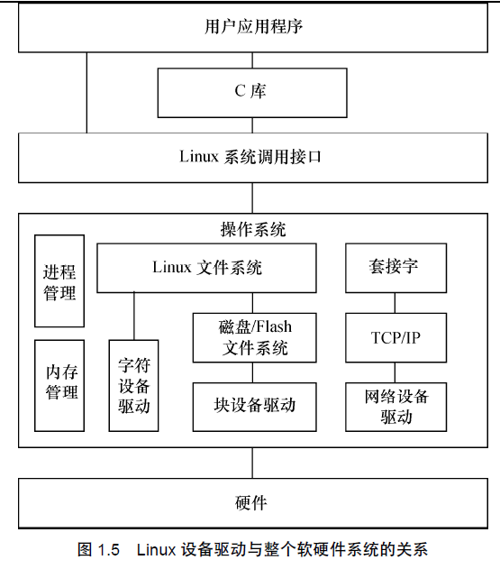
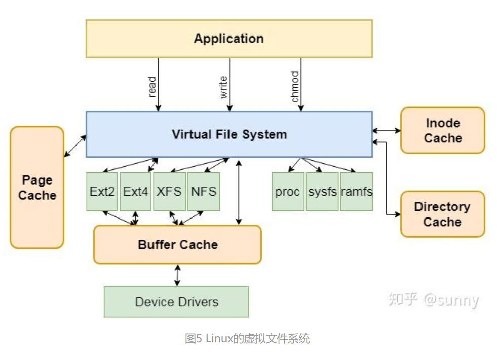

### 总览
```
内核-->设备驱动-->硬件驱动-->硬件
```

### 设备
[设备](https://www.binss.me/blog/sysfs-udev-and-Linux-Unified-Device-Model/)

1、设备类型
```
块设备
字符设备
网络设备
```

2、设备文件系统（sysfs）
```
怎么将电脑上的设备向用户展示和使用呢？
sysfs 是一个基于内存的虚拟的文件系统，由 kernel 提供，挂载到 /sys 目录下，负责以设备树的形式向 user space 提供直观的设备和驱动信息。

从 Linux 2.6 起，devfs 被 sysfs + udev 所取代。

```

3、设备模型
```
//核心模型
（1）kobject
    核心,kobject 对象都对应于sysfs 文件系统中的一个目录.包含不同 kobj_type 的 kobject 可以看做不同的子类。通过实现相同的函数来实现多态。

（2）kset
    kobject 的容器，维护了其包含的 kobject 链表

（3）device / driver / bus / class
    Linux 设备模型的更上一层表述是 device / driver / bus / class
    1) device 描述了一项设备
    2) 设备依赖于 driver 来进行驱动，对应的数据结构为 device_driver
    3) bus 设备总是插在某一条总线上的，对应的数据结构为 bus_type
    4) 一种设备分类，对应的数据结构为 class
    driver 用于驱动 device ，其保存了所有能够被它所驱动的设备链表。bus 是连接 CPU 和 device 的桥梁，其保存了所有挂载在它上面的设备链表和驱动这些设备的驱动链表。class 用于描述一类 device ，其保存了所有该类 device 的设备链表。

sysfs 本质上就是通过 VFS 的接口去读写 kobject 的层次结构后动态建立的内存文件系统

```

4、设备驱动
```
设备驱动        设备文件系统
kobject ----  操作与展示（device / driver / bus / class）
```

### 设备号与设备文件与设备
```
在Linux下，一切皆文件，设备也不例外，为了管理这些设备，系统为它们各自赋予设备号

当我们创建一个设备节点(设备文件)时需要指定设备号

设备号包括主设备号和次设备号

主设备号用来区分不同种类的设备      
次设备号用来区分同一类型的多个设备  ls -l /dev

主设备号用来表示一个特定的驱动程序
次设备号用来表示使用该驱动程序的各设备

// 查看主设备
/proc/devices
// 查看所有设备
ls -l /dev
// 注意
linux中没有网络设备文件

例如一个嵌入式系统，有两个LED指示灯，LED灯需要独立的打开或者关闭
LED灯的字符设备驱动程序
主设备号注册成5号设备(设备类型)
次设备号分别为1和2(分别表示两个LED灯)
```

### 驱动
1、Linux 设备驱动
```
字符设备；  
块设备；    FAT、EXT4...
网络设备:   
```

2、Linux 设备驱动与整个软硬件系统的关系



3、Linux 系统中虚拟文件系统、硬件文件及一般的设备文件与设备驱动程序之间的关系


4、设备文件系统
```
设备文件系统就是对设备初始化时创建设备文件，设备驱动程序可以指定设备号、所有者、用户空间等信息
就是用来对设备进行管理的一种文件系统

devfs（旧）、sysfs（用户空间）
udev是一种工作在用户空间工具，根据系统中的硬件设备的状况动态更新设备文件，包括设备文件的创建，删除等。需要内核sysfs和tmpfs的支持，sysfs为udev提供设备入口和uevent通道，tmpfs为udev设备文件提供存放空间。

从 Linux 2.6 起，devfs 被 sysfs + udev 所取代

//sysfs
sysfs 是一个基于内存的虚拟的文件系统，由 kernel 提供，挂载到 /sys 目录下(用 mount 查看得到 sysfs on /sys type sysfs (rw,nosuid,nodev,noexec,relatime))，负责以设备树的形式向 user space 提供直观的设备和驱动信息。sysfs的一个目的就是展示设备驱动模型中各组件的层次关系，其顶级目录包括block、device、bus、drivers、class、power 和firmware。

//设备模型
sysfs 的功能基于 Linux 的统一设备模型，其由以下结构构成：
kobject     统一设备模型中最基本的对象
kset        kobject 的容器，维护了其包含的 kobject 链表

udev从kernel中收到一个设备的uevent ---> 添加设备的uevent ---> 

```

### 相关问题
```
(1)vfs与设备驱动与硬件的关系
(2)内核驱动与用户驱动
```

### sysfs与udev的关系
```
比如write(fd, ...)系统调用，在内核里的代码就是调用filp->write(...)，这里的filp不关心文件到底是ext2还是ntfs。
当然，它最终还是会调用到ext2_write或者是ntfs_write。
sysfs是一种具体的fs，跟ext2/nts是平级的，不同的是，它完全只存在于内存里（跟procfs类似）。

udev是一种工具，它能够根据系统中的硬件设备的状况动态更新设备文件，包括设备文件的创建，删除等。设备文件通常放在/dev目录下，使用udev后,在/dev下面只包含系统中真实存在的设备。它于硬件平台无关的，位于用户空间，需要内核sysfs和tmpfs的支持，sysfs为udev提供设备入口和uevent通道，tmpfs为udev设备文件提供存放空间。（tmpfs虚拟内存文件系统，可以一些程序的临时文件放置在tmpfs中（需要挂载），利用tmpfs比硬盘速度快的特点提升系统性能。但是超过预设的大小时，就会写到硬盘中）
```

### io层
```
1、
随机读取：块设备（硬盘）
顺序读取：字符设备（键盘）
2、
块设备最小的寻址单元是扇区（2^n 512）
内核按块，磁盘按区
```

(1) buffer_head
```
内存一次读取一个块，一个块包含多个扇区，一个页可容纳多个块
一个快对应一个缓冲区
缓冲区头表示磁盘块与物理内存的映射

struct buffer_head {
    unsigned long b_state;        /* buffer state bitmap (see above) *缓冲区的状态标志/
    struct buffer_head *b_this_page;/* circular list of page's buffers *页面中缓冲区/
    struct page *b_page;        /* the page this bh is mapped to *存储缓冲区的页面/

    sector_t b_blocknr;        /* start block number *逻辑块号/
    size_t b_size;            /* size of mapping *块大小/
    char *b_data;            /* pointer to data within the page *指向页面中数据的指针/

    struct block_device *b_bdev;       //对应的块设备
    bh_end_io_t *b_end_io;              /* I/O completion */
     void *b_private;                   /* reserved for b_end_io *I/O完成的方法/
    struct list_head b_assoc_buffers;   /* associated with another mapping */
    struct address_space *b_assoc_map;    /* mapping this buffer is
                                    associated with *缓冲区对应的映射，即address_space/
    atomic_t b_count;        /* users using this buffer_head *表示缓冲区的使用计数/
};
```

### 字符设备
```
1、cdev 结构体
    struct cdev {
        struct kobject kobj; /* 内嵌的kobject 对象 */
        struct module *owner; /*所属模块*/
        struct file_operations *ops; /*文件操作结构体*/
        struct list_head list;
        dev_t dev; /*设备号*/
        unsigned int count;
    };
    > file_operations
        file_operations定义了字符设备驱动提供给虚拟文件系统的接口函数


```

(1)设备编号
```
//静态分配
int register_chrdev_region(dev_t first, unsigned int count, char *name);
    //count 是你请求的连续设备编号的总数. 注意, 如果count 太大, 你要求的范围可能溢出到下一个次编号
    //name 是应当连接到这个编号范围的设备的名子

//动态分配
int alloc_chrdev_region(dev_t *dev, unsigned int firstminor, unsigned int count, char *name);

//如果分配成功，返回0
//设备编号会出现在/proc/devices和sysfs中

//清除设备号
void unregister_chrdev_region(dev_t first, unsigned int count);

```

(2)模块加载
```
//加载模块(scull)
insmod scull.ko 
//根据生成的主设备号创建设备节点,比如主设备号是100
mknod /dev/scull0 c 100 0   //创建第一个设备
mknod /dev/scull1 c 100 1   //创建第二个设备
//change the group and mode
chgrp $group /dev/${device}[0-3]
chmod $mode /dev/${device}[0-3]

```

(3)关键结构
```
struct file_operations scull_fops = {
    .owner = THIS_MODULE,
    .llseek = scull_llseek,
    .read = scull_read,
    .write = scull_write,
    .ioctl = scull_ioctl,
    .open = scull_open,
    .release = scull_release,
}

struct file 
{
    mode_t f_mode;
    loff_t f_pos;
    unsigned int f_flags;
    struct file_operations *f_op;
    void *private_data;
    struct dentry *f_dentry;  --> d_inode
}

struct inode
{
    dev_t i_rdev;
    struct cdev *i_cdev;
}
```

(4)字符设备注册
```
#include <linux/cdev.h>
//类似这样
struct cdev *my_cdev = cdev_alloc();
my_cdev->ops = &my_fops;

//初始化
void cdev_init(struct cdev *cdev, struct file_operations *fops);
//关联设备
int cdev_add(struct cdev *dev, dev_t num, unsigned int count);
    //num 是这个设备响应的第一个设备号
    //count 是应当关联到设备的设备号的数目. 常常 count 是 1, 但是有多个设备号对应于一个特定的设备的情形
//去除一个字符设备
void cdev_del(struct cdev *dev);
//你不应当在传递给 cdev_del 后存取 cdev 结构
//核心代码
cdev_init(&dev->cdev, &scull_fops);
dev->cdev.owner = THIS_MODULE;
dev->cdev.ops = &scull_fops;
err = cdev_add (&dev->cdev, devno, 1);

//以前的初始化代码（早些机制避免使用cdev）
int register_chrdev(unsigned int major, const char *name, struct file_operations *fops);
//老的去除设备代码
int unregister_chrdev(unsigned int major, const char *name);

```

(5)scull结构
```
struct scull_dev {
    struct scull_qset *data; /* Pointer to first quantum set */
    int quantum; /* the current quantum size */
    int qset; /* the current array size */
    unsigned long size; /* amount of data stored here */
    unsigned int access_key; /* used by sculluid and scullpriv */
    struct semaphore sem; /* mutual exclusion semaphore */
    struct cdev cdev; /* Char device structure */
}

struct scull_qset {
    void **data;
    struct scull_qset *next;
};
```

(6)open方法
```
检查设备特定的错误(例如设备没准备好, 或者类似的硬件错误)
如果它第一次打开, 初始化设备
如果需要, 更新 f_op 指针.
分配并填充要放进 filp->private_data 的任何数据结构
int (*open)(struct inode *inode, struct file *filp)

struct scull_dev *dev;
dev = container_of(inode->i_cdev, struct scull_dev, cdev) ; //这是个宏, 后面两个参数是类型 

#define container_of(ptr, type, member) ({              \         
const typeof( ((type *)0)->member ) *__mptr = (ptr);    \         
(type *)( (char *)__mptr - offsetof(type,member) );})

filp->private_date = dev;
if ((filp->f_flags & O_ACCMODE) == O_WEONLY){
    scull_trim(dev);
}

```

(7)read和write
```

```

### 内核并发
```

```

