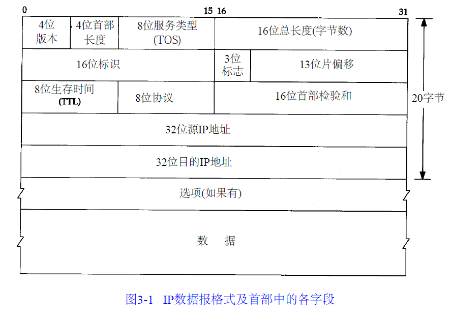

# 概述
## 封装
[数据进入协议栈时的封装过程](../picture/10.png)
## 客户端-服务器模型
服务分为两种类型：重复型或并发型。
一般来说， T C P服务器是并发的，而U D P服务器是重复的，但也存在一些例外
## 端口号
大多数Unix系统的文件/etc/services都包含了人们熟知的端口号
## 应用编程接口
TCP/IP协议的应用程序通常采用两种应用编程接口（API）：socket和TLI

# 链路层
## 链路层目的
```
（1）为IP模块发送和接收IP数据报；
（2）为ARP模块发送ARP请求和接收ARP应答；
（3）为RARP发送RARP请求和接收RARP应答。
TCP/IP支持多种不同的链路层协议取决于网络所使用的硬件，如以太网、令牌环网、FDDI（光纤分布式数据接口）及RS-232串行线路
```

## 以太网链路层协议（多个连接在一起）
```
以太网和IEEE 802封装
1、以太网
是当今TCP/IP采用的主要的局域网技术，速率为10Mb/s，地址为48bit，
2、IEEE 802
802.3针对整个CSMA/CD网络，802.4针对令牌总线网络， 802.5针对令牌环网络
[IEEE 802.2/802.3（RFC 1042）和以太网的封装格式（RFC 894）](../picture/11.png)
```

## 两个串行接口链路层协议（点对点连接，所以没有以太网的头部）
```
（1）SLIP和CSLIP
（2）PPP
点对点链路链接不用ARP协议
```

## 环回接口
```
允许运行在同一台主机上的客户程序和服务器程序通过TCP/IP进行通信，P地址127.0.0.1分配给这个接口，并命名为localhost。一个传给环回接口的IP数据报不能在任何网络上出现。
[环回接口处理IP数据报的过程](../picture/12.png)
```

## 以太网帧
```
| Mac首部 | IP首部 | TCP首部 | HTTP首部 | HTML数据 |
<------------------以太网帧----------------------->
          <--------------以太网帧的净荷------------>
                  <---------ip净荷---------------->
                        <--------tcp净荷---------->
```

## MTU
```
```

# IP协议
## IP首部

```
(0-3) 4位版本号：IPv4
(4-7) 首部长度：首部占32bit字的数目,例如5表示5*32=20byte（所以首部肯定为32的整数倍）
(8-15) 8位服务类型（TOS）:包括一个3bit的优先权子字段（现在已被忽略），4 bit的TOS子字段和1bit未用位但必须置0,4bit中只能置其中1bit。如果所有4 bit均为0，那么就意味着是一般服务。4bit分别代表最小时延、最大吞吐量、最高可靠性和最小费用
(16-31) 16位总长度，整个IP数据报的长度，以字节为单位，最长可达65535字节，但是大多数的链路层都会对它进行分片
(32-47) 16位标识，每发送一份报文它的值就会加1
(48-63) 3位标识，13位片偏移
(64-71) 8位生存时间（TTL）,一旦经过一个处理它的路由器，它的值就减去1。当该字段的值为0时，数据报就被丢弃
(72-79) 8位协议，指的是TCP、UDP、ICMP、IGMP
(80-95) 16位首部检验和，首部每个16位进行反码求和，结果存在检验和字段中。当收到ip数据报时，对首部每个16位进行反码求和（包含了检验和字段），结果应该为1（由于路由器经常只修改TTL字段（减1），因此当路由器转发一份报文时可以增加它的检验和，而不需要对IP整个首部进行重新计算）
(96-127) 32位源ip地址
(128-159) 32位目的ip地址
(160-?) 附加项字段，路径路由ip等
```

## IP路由选择
```
IP层在内存中有一个路由表，当收到一份数据报时，先检查ip是否为本机ip地址之一或广播地址，
如果是按照ip首部制指定的协议进行处理，不是就进行转发（路由选择）
路由表包含：
（1）目标IP地址：完整的主机地址或者一个网络地址
（2）下一站路由IP地址：
（3）标志：目的ip是网络还是主机地址
路由选择：
（1）能与目的IP完全匹配的表目，发送指定的下一站路由或网路接口
（2）能与目的IP网络号匹配的表目，发送指定的下一站路由或网路接口
（3）发送默认表目
```

## 子网寻址（子网掩码）
```
//结构
     网络号    子网号    主机号

//子网掩码
     作用是多少比特用于子网号及多少比特用于主机号

//在主机上设置子网掩码的作用只有一个，就是判断将要连接的ip地址和主机是否处于一个子网，如果是，则只经过数据链路层，直接发送到ip地址，而不经过路由，否则将数据包发送到路由。

//掩码是一个32bit的值，其中值为1的比特留给网络号和子网号，为0的比特留给主机号。
两种不同类型
B类:11111111 11111111 11111111    00000000
         网络号16位     子网号      主机号
    11111111 11111111 11111111 11 000000
         网络号16位     子网号      主机号
```

## 相关命令
```
//ipconfig

//netstat
     提供系统上的接口信息
```


# ARP和RARP协议
1、ARP
```
//概念
     ARP协议是地址解析协议（Address Resolution Protocol）是通过解析IP地址得到MAC地址的，是一个在网络协议包中极其重要的网络传输协议，它与网卡有着极其密切的关系
     ARP发送一份称作ARP请求的以太网数据帧给以太网上的每个主机。这个过程称作广播。目的主机的ARP层收到这份广播报文后，识别出这是发送端在寻问它的IP地址，于是发送一个ARP应答。这个ARP应答包含IP地址及对应的硬件地址。收到ARP应答后，使ARP进行请求—应答交换的IP数据报现在就可以传送了

//命令
     检查arp高速缓存中Ip地址到硬件地址之间的映射记录：arp -a

//交换机与路由器
     交换机主要工作在数据链路层（第二层），交换机转发所依据的对象时：MAC地址。（物理地址）
     路由器工作在网络层（第三层）。路由转发所依据的对象是：IP地址。（网络地址）
     所以需要ARP协议，需要目的IP地址的MAC地址

//发送过程
     我的电脑 ------------> 网关 -------------> 服务器
               网关的MAC          服务器的MAC
     注意：点对点链路不涉及ARP协议

//免费ARP
     一种ARP特性，它是指主机发送ARP查找自己的IP地址。通常，它发生在系统引导期间进行接口配置的时候     
     主要用于检测网络中IP地址是否冲突，它是一种功能而非协议。向自己所在网络请求自己的MAC地址，当网络中如果有其他主机使用了与自己相同的IP地址，他就会给主机一个ARP回复，此时如果发免费ARP的主机收到了回复就证明自己所用的IP地址有冲突，如果没有收到回复则说明没有IP地址冲突。

```

2、RARP
```
//概念
     ARP是实现IP到MAC地址的映射，而RARP是实现MAC到IP地址的映射。

```


# TCP
1、概念
```
|           16位源端口号            |          16位目的端口号              |
|                              32位序列号                                 |
|                              32位确认序号                               |
| 4位首部长度 | 保留6位 | URG | ACK | PSH | RST | SYN | FIN | 16位窗口大小 |
|          16位检验和              |        16位紧急指针                  |
|                                选项                                    |
|                                数据                                    |


```

2、tcp连接与终止
```

```


## TCP章节
### 


