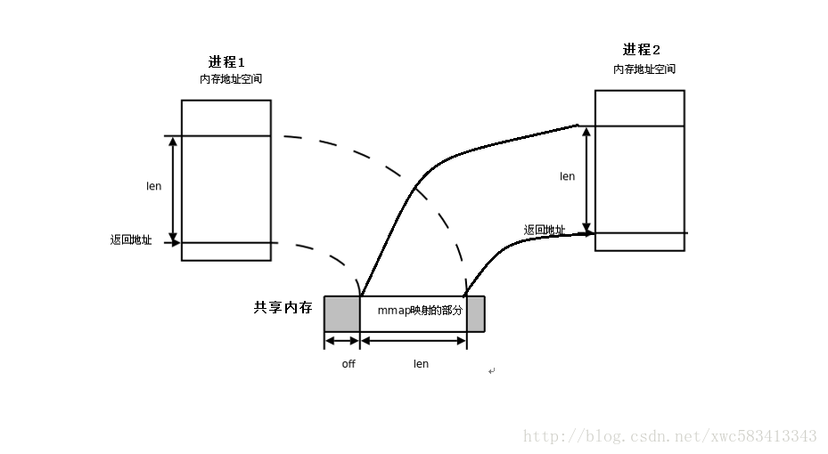

unix环境编程
|包含unix编程、网络编程及相关操作系统概念

### 异步与非阻塞
```
1、讨论同步、异步、阻塞、非阻塞时，必须先明确是在哪个层次进行讨论
2、讨论究竟是异步还是同步，一定要严格说明说的是哪一部分
3、从Linux接口的角度说，阻塞和非阻塞都是同步。libaio那些才是异步。真正异步接口一般是你提供一个缓冲区给接口，然后接口立即返回，在一段时间之后通过另一种机制（回调，消息，信号等）通知你完成，在通知完成之前缓冲区你不能碰，系统在读写。
4、在处理 IO 的时候，阻塞和非阻塞都是同步 IO，只有使用了特殊的 API 才是异步 IO。
5、对unix来讲：阻塞式I/O(默认)，非阻塞式I/O(nonblock)，I/O复用(select/poll/epoll)都属于同步I/O，因为它们在数据由内核空间复制回进程缓冲区时都是阻塞的(不能干别的事)。只有异步I/O模型(linux的libaio)是符合异步I/O操作的含义的，即在1数据准备完成、2由内核空间拷贝回缓冲区后 通知进程，在等待通知的这段时间里可以干别的事。
6、阻塞，非阻塞：进程/线程要访问的数据是否就绪，进程/线程是否需要等待；
   同步，异步：访问数据的方式，同步需要主动读写数据，在读写数据的过程中还是会阻塞；异步只需要I/O操作完成的通知，并不主动读写数据，由操作系统内核完成数据的读写。
7、《UNIX网络编程：卷一》对unix的io讲得明明白白。
8、 说白了，同步需要从内核空间拷贝到用户空间，异步是内核帮你把数据拷贝到用户空间，所以异步需要底层api的支持。而阻塞和非阻塞是指进程访问的数据是否准备就绪，没有就绪则等待！！！

9、异步有异步io和异步操作，异步io如第八步所说的，而异步操作就多了，多线程、协程。。。，所以要根据软件的涉及。

```

---
#### 异步的进化
```
1、远古时代（回调函数）
2、promise时代
	promise().then().then()
3、Generator生成器
	实现代码生成器，实现switch（）类型的协程，异步。但不是真正异步
co(function *(){
    let db, collection, result; 
    let person = {name: "yika"};
    try{
        db = yield mongoDb.open();
        collection = yield db.collection("users");
        result = yield collection.insert(person);
    }catch(e){
        console.error(e.message);
    }
    console.log(result);
});

4、async/await时代
	真正的协程，实现异步最优雅的方式，用同步的方式写异步！
async function insertData(person){
    let db, collection, result; 
    try{
        db = await mongoDb.open();   //切除该协程，
        collection = await db.collection("users");
        result = await collection.insert(person);
    }catch(e){
        console.error(e.message);
    }
    console.log(result);
} 

```

---
### 协程的原理
```
//对称与非对称
对称类似于生产者、消费者之间协程的切换，并不涉及栈空间的销毁
非对称类似于函数的调用

//有栈与无栈
有栈：比如ucontext中的，协程有自己的栈空间，协程的切换涉及寄存器的保存和栈内数据的恢复问题，所以性能一般
无栈：用this来索引对象的成员变量，上下文就是对象自己。访问上下文数据也就是成员变量的时候，我们无需显式的使用this+成员偏移量（或者变量名）来访问，而是直接访问变量名。
两种协程访问的上下文中的数据，生命周期都大于函数的返回：栈的生命周期晚于函数的返回，this对象的生命周期晚于函数的返回。后者更晚而且往往需要手工销毁。

//hook
协程的意义就是阻塞异步，所以一些io函数必须设计为，非阻塞异步

//switch语法糖的实现协程

async/await的出现，实现了基于stackless coroutine的完整coroutine。在特性上已经非常接近stackful coroutine了，不但可以嵌套使用也可以支持try catch。所以是不是可以认为async/await是一个更好的方案？

```

---
### c++异步编程
c++11的promise、async、future属于多线程异步，所以单线程异步只能用协程和异步callback
异步是协程的一种实现方式，协程是异步的封装方法
```
1、promise、async的多线程异步回调（异步工作流）
2、协程（更优雅）
```

---
### c++高性能网络库 
```
libevent、libev、boost::asio
```

---
### c++ asio
```
推荐boost::asio
c++20标准库网络部份将基于asio，c++ asio异步编程很重要！！！
```

---
### 有栈协程相关模块
```
云风的coroutine库
libgo
golang
boost::asio
```

---
### 无栈协程相关模块
```
c++20的coroutine(基于asio)
知乎朱元的库
Es6的async/wait模型
boost::asio
```

---
### hook（linux钩子）
由于是调用得动态链接库中函数，我们可以通过劫持该函数的方式引入额外处理。 例如通过劫持 malloc、free 来追踪内存使用情况等等
```
//my_hook.c
#define _GNU_SOURCE
#include <stdio.h>
#include <stdint.h>
#include <dlfcn.h>

#define unlikely(x) __builtin_expect(!!(x), 0)
#define TRY_LOAD_HOOK_FUNC(name) if (unlikely(!g_sys_##name)) {g_sys_##name = (sys_##name##_t)dlsym(RTLD_NEXT,#name);}

typedef void* (*sys_malloc_t)(size_t size);
static sys_malloc_t g_sys_malloc = NULL;
void* malloc(size_t size)
{
    TRY_LOAD_HOOK_FUNC(malloc);
    void *p = g_sys_malloc(size);
    printf("in malloc hook function ...\n");
    return p;
}

typedef void (*sys_free_t)(void *ptr);
static sys_free_t g_sys_free = NULL;
void free(void *ptr)
{
    TRY_LOAD_HOOK_FUNC(free);
    g_sys_free(ptr);
    printf("in free hook function ...\n");
}

gcc -fPIC -shared -o libmyhook.so my_hook.c -ldl
gcc -o main main.c ./main
LD_PRELOAD=./libmyhook.so ./main

//LD_PRELOAD
能够影响程序运行时候动态链接库的加载，可以通过设置其来优先加载某些库，进而覆盖掉某些函数

//内联优化
由于编译器存在内联优化，不会调用库中的目标函数，所以必须关闭目标函数优化
-fno-builtin-strcmp，关闭 strcmp 函数的优化 
gcc -o main main.c -fno-builtin-strcmp

```

### 多路复用与异步IO
1、多路复用(同步非阻塞IO)
select #(select实例)[https://blog.csdn.net/u010155023/article/details/53507788]
epoll #(epoll实例)[https://blog.csdn.net/davidsguo008/article/details/73556811]
```
当某一进程调用epoll_create方法时，Linux内核会创建一个eventpoll结构体，这个结构体中有两个成员与epoll的使用方式密切相关。eventpoll结构体如下所示：
struct eventpoll{
    ....
    /*红黑树的根节点，这颗树中存储着所有添加到epoll中的需要监控的事件*/
    struct rb_root  rbr;
    /*双链表中则存放着将要通过epoll_wait返回给用户的满足条件的事件*/
    struct list_head rdlist;
    ....
};

每一个epoll对象都有一个独立的eventpoll结构体，用于存放通过epoll_ctl方法向epoll对象中添加进来的事件。这些事件都会挂载在红黑树中,如此，重复添加的事件就可以通过红黑树而高效的识别出来(红黑树的插入时间效率是lgn，其中n为树的高度)。

而所有添加到epoll中的事件都会与设备(网卡)驱动程序建立回调关系，也就是说，当相应的事件发生时会调用这个回调方法。这个回调方法在内核中叫ep_poll_callback,它会将发生的事件添加到rdlist双链表中。
在epoll中，对于每一个事件，都会建立一个epitem结构体，如下所示：
struct epitem{
    struct rb_node  rbn;//红黑树节点
    struct list_head    rdllink;//双向链表节点
    struct epoll_filefd  ffd;  //事件句柄信息
    struct eventpoll *ep;    //指向其所属的eventpoll对象
    struct epoll_event event; //期待发生的事件类型
}

当调用epoll_wait检查是否有事件发生时，只需要检查eventpoll对象中的rdlist双链表中是否有epitem元素即可。如果rdlist不为空，则把发生的事件复制到用户态，同时将事件数量返回给用户。


```

---
### fuse 用户空间文件系统
[fuse架构](../picture/fuse架构.png)
```
1、用户态app调用glibc open接口，触发sys_open系统调用。
2、sys_open 调用fuse中inode节点定义的open方法。
3、inode中open生成一个request消息，并通过/dev/fuse发送request消息到用户态libfuse。
4、Libfuse调用fuse_application用户自定义的open的方法，并将返回值通过/dev/fuse通知给内核。
5、内核收到request消息的处理完成的唤醒，并将结果放回给VFS系统调用结果。
```

---
### 进程间通信（IPC）

[进程间通信](https://zhuanlan.zhihu.com/p/37872762)

(1)概念
```
1、管道：是第一个广泛使用的IPC形式，既可以在程序中使用，也可以在shell中使用。管道存在的问题在于他们只能在具有共同祖先（指父子进程之间）的进程间使用，不过该问题已经被有名管道（named pipe）即FIFO消息队列解决了。
2、信号量
3、消息队列：消息队列是在两个不相关进程间传递数据的一种简单、高效方式，她独立于发送进程、接受进程而存在。消息队列是数据结构，存放在内存，访问速度快。但管道是文件，存放在磁盘上，访问速度慢。管道是数据流式存取，消息队列是数据块式存取。（rpc也是信号量的一种）
4、共享内存（同一机器下最快）
```

---
#### pipe(无名管道)
父子进程互相传递信号
```
#include <unistd.h>

int fd[2]; //0:读  1:写
int ret = pipe(fd);
if (ret==-1)perror();
pid_t pt = fork();
if (pt>0){
    close(fd[0]);       //关闭读
    write(fd[1]...);    
}else{
    close(fd[1]);       //关闭写
    read(fd[0]...);
}
```

---
#### FIFO(有名管道)
不同进程互相传递信号
```
#include <sys/stat.h>
mkfifo("file",0755);
int fd = open("file",O_RDONLY); //O_WRONLY
close(fd);

linux保证了写管道的原子性，但是每次写不能大于pipe_buf

```

---
#### 信号量
POSIX信号量与System V信号量
```
都是用于线程和进程同步的。
Posix信号量是基于内存的，即信号量值是放在共享内存中的，与文件系统中的路径名对应的名字来标识的。性能更优越
System v信号量测试基于内核的，它放在内核里面。
```

(1)POSIX信号量
```
//一个进程创建POSIX信号量
#include <semaphore>
#define FILE_MODE (S_IRUSR|S_IWUSR|S_IRGRP|S_IROTH)

int main(){
    sem_unlink("file");  //防止所需的信号量已存在
    sem_t* mutex;
    if (mutex = sem_open("file",O_CREAT|O_EXCL,FILE_MODE,1) == SEM_FAILED){
        error("mutex");
        exit(-1);
    }
    sem_close(mutex);   //关闭
}
//另外一个进程运用POSIX信号量
#include <semaphore.h>

int main(){
    sem_t* mutex;
    if ((mutex = sem_open("file",0)) == SEM_FAILED){ //打开信号量
        error;
    }
    sem_wait(mutex);        //加锁
    ...
    sem_post(mutex);        //释放锁
}
```

(2)System V信号量
```
#include <sys/sem.h>
#include <sys/types.h>
#include <sys/stat.h>
#include <fcntl.h>

int sem_id;
int set_semvalue(){
    union semun sem_union;
    sem_union.val = 1;
    if (semctl(sem_id,0,SETVAL,sem_union) == -1) return(0);
    return(1);
}
void del_semvalue(){
    union semun sem_union;
    if (semctl(sem_id,0,IPC_RMID,sem_union) == -1) perror();
}
int semaphore_p(){
    struct sembuf sem_b;
    sem_b.sem_num = 0;
    sem_b.sem_op = -1; //P()
    sem_b.sem_flg = SEM_UNDO;
    if (semop(sem_id,&sem_b,1) == -1)return(0);
    return(1);
}
int semaphore_v(){
    struct sembuf sem_b;
    sem_b.sem_num = 0;
    sem_b.sem_op = 1; //V()
    sem_b.sem_flg = SEM_UNDO;
    if (semop(sem_id,&sem_b,1) == -1)return(0);
    return(1);
}

int main(){
    key_t key = ftok("file",3);
    sem_id = semget(key,1,0666|IPC_CREAT); //创建信号量
    if (!set_semvalue()) perror();  //初始化信号量

    if (!semaphore_p()) perror;  //进入临界区
    ...
    if (!semaphore_v()) perror; //离开临界区

    del_semvalue();
}
```

---
#### 共享内存
```
分两种
System V的shmget()得到一个共享内存对象的id，用shmat()映射到进程自己的内存地址
POSIX的shm_open()打开一个文件，用mmap映射到自己的内存地址
```

注意：以上两种方式要用信号量同步

(1)shmget
```
//进程一 read
#include<sys/shm.h>
#include <sys/types.h>
#include <sys/ipc.h>
#define MEM_KEY (1234)

typedef struct _shared{
    int text[10];
}shared;

int main(){
    key_t key = ftok("file",0x03); //proj_id是一个1－255之间的一个整数值，典型的值是一个ASCII值
    int shmid = shmget((key_t)MEM_KEY, sizeof(shared),0666|IPC_CREAT|IPC_EXCL); //创建共享内存,如果存在则报错
    //int shmid = shmget(key,sizeof(shared,IPC_CREAT|0666));
    if (shmid == -1) perror();
    void* shm = shmat(shmid,0,0); //连接当前进程地址空间
    if（shm == (void*)-1）perror();
    shared* my = (shared*)shm;
    printf("%d\n",my->text[1]);
    if (shmdt(shm) == -1) perror();    //把共享内存从当前进程分离
    if (shmctl(shmid,IPC_RMID, 0) == -1) perror //删除共享内存
}

//进程二 write
#include<sys/shm.h>
#define MEM_KEY (1234)

typedef struct _shared{
    int text[10];
}shared;

int main(){
    int shmid = shmget((key_t)MEM_KEY, sizeof(shared),0666|IPC_CREAT); //创建共享内存
    if (shmid == -1) perror();
    shm = shmat(shmid, 0, 0);
    if（shm == (void*)-1）perror();
    shared* my = (shared*)shm;
    my->text[1] = 5;
    if (shmdt(shm) == -1) perror();
}
```
(2)shm_open+mmap
```
//server
#include <sys/mmap.h>
#include <sys/shm.h>
#include <sys/stat.h>
#include <fcntl.h>
#define  FILE_MODE (S_IRUSR | S_IWUSR | S_IRGRP | S_IROTH)

typedef struct __ST{
     char text[5];
}ST;

int main(){
    shm_unlink("file");  //防止file已存在
    int fd = shm_open("file",O_RDWR|O_CREAT,FILE_MODE);
    if (fd == -1) perror();
    ftruncate(fd,sizeof(ST));
    ST* ptr;
    ptr = mmap(NULL,sizeof(ST),PROT_READ|PROT_WRITE,MAP_SHARED,fd,0);
    if (ptr == SEM_FAILED) perror();
    ptr->text[1] = 'a';
    close(fd);

}

//client
#include <sys/mman.h>
#include <sys/stat.h>
#include <sys/types.h>
#include <fcntl.h>
typedef struct _ST{
    char text[5];
}ST;

int main(){
    int fd = shm_open("file",O_RDWR,FILE_MODE);
    ptr = mmap(NULL,sizeof(ST),PROT_READ|PROT_WRITE,MAP_SHARED,fd,0);
    printf("%c",ptr->text[1]);
    close(fd);
}
```
---
### 消息队列（一种有名管道）
```
消息队列提供了一种从一个进程向另一个进程发送一个数据块的方法。 
消息队列可以认为是一个消息链表，某个进程往一个消息队列中写入消息之前，不需要另外某个进程在该队列上等待消息的达到，这一点与管道和FIFO相反。
```

---
### 消息队列与rpc
```
（1）RPC系统结构：
+----------+     +----------+
| Consumer | <=> | Provider |
+----------+     +----------+
Consumer调用的Provider提供的服务。
//特点
同步调用，对于要等待返回结果/处理结果的场景，RPC是可以非常自然直觉的使用方式。# RPC也可以是异步调用。
由于等待结果，Consumer（Client）会有线程消耗。
如果以异步RPC的方式使用，Consumer（Client）线程消耗可以去掉。但不能做到像消息一样暂存消息/请求，压力会直接传导到服务Provider。

（2）Message Queue系统结构：
+--------+     +-------+     +----------+
| Sender | <=> | Queue | <=> | Receiver |
+--------+     +-------+     +----------+
Sender发送消息给Queue；Receiver从Queue拿到消息来处理。
//特点
Message Queue把请求的压力保存一下，逐渐释放出来，让处理者按照自己的节奏来处理。
Message Queue引入一下新的结点，让系统的可靠性会受Message Queue结点的影响。
Message Queue是异步单向的消息。发送消息设计成是不需要等待消息处理的完成。
所以对于有同步返回需求，用Message Queue则变得麻烦了。
```

---
### 进程间通信总结
```
服务器内进程间通信就用socket，低耦合，性能也还行，不用考虑其他乱七八糟的东西。但是如果考虑高性能，可以FIFO或者共享内存
服务期间用rpc、socket、消息队列
```

---
### 系统数据文件
1、/etc/password
```
存放着所有用户帐号的信息，包括用户名和密码，因此，它对系统来说是至关重要的
格式如下：
username:password:User ID:Group ID:comment:home directory:shell
```
2、/etc/shadow
```
存放系统的口令文件
```
3、/etc/group
```
用户组管理的文件,linux用户组的所有信息都存放在此文件中
格式如下：
组名:口令:组标识号:组内用户列表
```
4、/etc/hosts
```
Linux系统中一个负责IP地址与域名快速解析的文件
例如：
127.0.0.1   localhost localhost.localdomain localhost4 localhost4.localdomain4
```
5、/etc/services
```
Internet 守护程序（ineted）是 Linux 世界中的重要服务。它借助 /etc/services 文件来处理所有网络服务
格式如下：
service-name    port/protocol   [aliases..]  [#comment]
service-name 是网络服务的名称。例如 telnet、ftp 等。
port/protocol 是网络服务使用的端口（一个数值）和服务通信使用的协议（TCP/UDP）。
alias 是服务的别名。
comment 是你可以添加到服务的注释或说明。以 # 标记开头。
```
6、utmp和wtmp
```
/var/run/utmp（二进制） 命令 who
/var/log/wtmp（二进制） 命令 w
utmp记录当前登录到系统的用户
wtmp跟踪各个登陆与注销事件
```
7、uname和hostname
```
命令uname显示操作系统信息
命令hostname显示主机的域名
```
