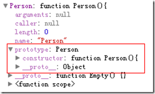
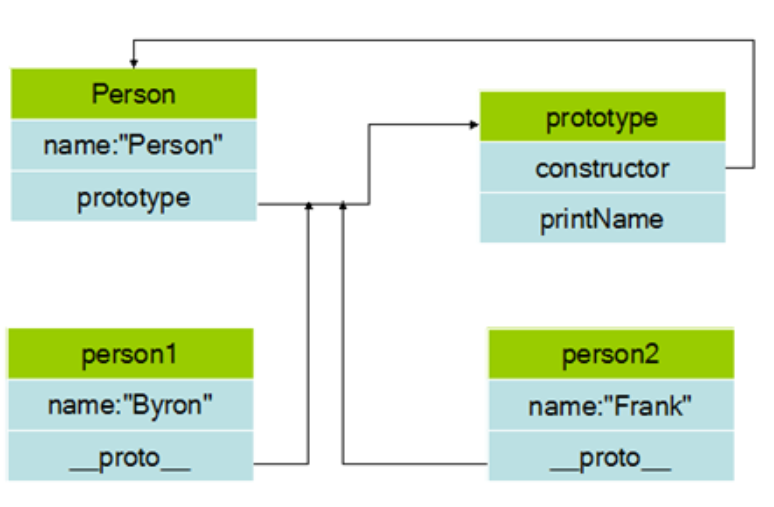

#### 继承
javascript是基于phototype的，不是基于类的。


在 JavaScript 中，不会创建类，也不会通过类来创建对象（就像在其他面向对象的语言中那样）。通过prototype.constructor()来实例化类。
添加内容供实例访问，原型对象包含函数实例共享的方法和属性，其中 prototype.constructor()可以当作函数的构造函数用
实例的__proto__ 指向函数的prototype
```
function Person(name){
           this.name=name;
}
Person.prototype.share=[];
Person.prototype.printName=function(){
       alert(this.name);
}
var person1=new Person('Byron');
var person2=new Person('Frank');

person1.__proto__ === Person.prototype  //true

person1.share.push(1);
person2.share.push(2);
console.log(person2.share); //[1,2] 可以理解为prototype创建的对象是全局的。
```

原型链

#### new
`var o = new Foo();`
JavaScript 实际上执行的是：
```
var o = new Object();
o.__proto__ = Foo.prototype;
Foo.call(o);
```

#### Object.creat(类似于继承)
```
Object.create =  function (o) { //注意o是一个实例
    var F = function () {};
    F.prototype = o;
    return new F();
};
```

#### 继承的简单实现

**下面的第一个函数表示 subFn构造函数是subFn，但是其他的变成了superFn**
```
function Extend(subFn, superFn){
    subFn.prototype = new superFn()   //注意 prototype 是一个原型对象
    subFn.prototype.constructor = subFn //新定义一个function
}
 
function Animal(){
    this.say1 = function(){
        alert("Animal");
    }
}
 
function Tiger(){
    this.say2 = function(){
        alert("Tiger");
    }
}
 
Extend(Tiger,Animal);
 
var tiger = new Tiger();
tiger.say1();//"Animal"
tiger.say2();//"Tiger"
```
简直精辟！！！！

#### canvas 旋转方法
```
var c=document.getElementById("myCanvas");
var ctx=c.getContext("2d");
var coorX = new Array(10,40,70);	
var coorY = new Array(30,30,30);	
var s = 0;
var tran = {x:[coorX[0]+s/2,coorX[1]+s/2,coorX[2]+s/2],y:[coorY[0]+s/2,coorY[1]+s/2,coorY[2]+s/2]};
console.log(tran.x);
console.log(tran.y);
ctx.font="30px Arial";
ctx.save();
	
ctx.strokeText("H",coorX[0],coorY[0]);	
ctx.translate(tran.x[0],tran.y[0]);
ctx.rotate(20*Math.PI/180);
ctx.translate(-tran.x[0],-tran.y[0]);
ctx.strokeText("H",coorX[0],coorY[0]);
```

#### 静态变量与实例变量
```
function obj(){
    obj.a=0; //类变量
    this.b=1;//实例变量
}
console.log(obj.a);
var my = new obj();
console.log(my.b);
```

#### prototype与__proto__
函数（只有函数）中都有prototype属性，对象具有属性__proto__，可称为隐式原型，一个对象的隐式原型指向构造该对象的构造函数的原型，这也保证了实例能够访问在构造函数原型中定义的属性和方法。
对象具有属性__proto__，可称为隐式原型，一个对象的隐式原型指向构造该对象的构造函数的原型，这也保证了实例能够访问在构造函数原型中定义的属性和方法。
prototype:
constructor:this
\_\_proto\_\_:object

#### 函数默认参数
`var func=function(x,y=2){console.log(x,y);}`

#### instanceof
instanceof 运算符是用来在运行时指出对象是否是特定类的一个实例。

#### 原型的理解
* __proto__
```
var Unical={
    name:'liyi',
    age:31,
    hello:function(){
        alert('Hello, '+this.name+'!');
    }
}
var qinbb={
    name:'qinbb',
    age:24
}
qinbb.__proto__=Unical;
```
原型链：qinbb--->Unical.prototype--->Object.prototype--->null
* 实例
```
function Leader(name){
    this.name=name;
    this.hello=function(){
        alert(this.name+' is a leader !');
    }
}
var liyi= new Leader('liyi');
var qinbb = new Leader('qinbb');
liyi.hello===qinbb.hello;//输出：false 虽然调用同一个函数，但是并不相同 解
Object.getPrototypeOf(liyi);//输出 Object {}
liyi.constructor===Leader.prototype.constructor;//true 
liyi.__proto__===Leader.prototype;//true
Leader.prototype.constructor; //会显示 function Leader(){}
Leader.prototype.run = function(){}
liyi.run === qinbb.run // true
```

---
#### join
```
var a=[]
a.join(';')
```

---
#### querystring
```
querystring.parse('a=3&b=4')
{ a: '3', b: '4' }
```

---
#### JSON
```
a={a:1,b:2}
x= JSON.stringify(a)
y= JSON.parse(x)
```

---
#### trim
去除string前后空字符
```
var a = ' dsaa '
a.trim()
```